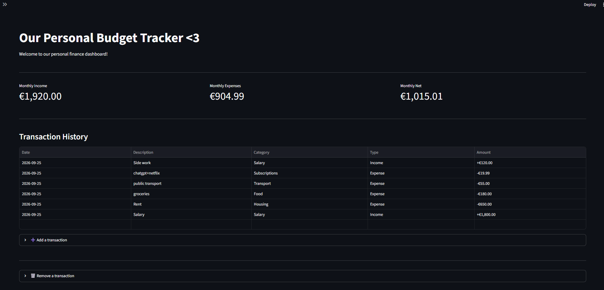
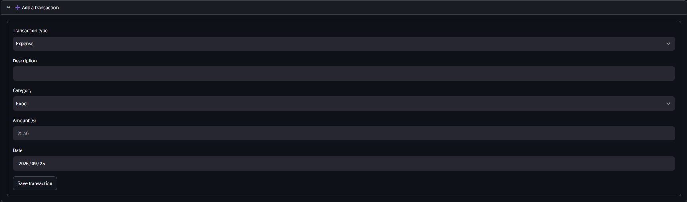
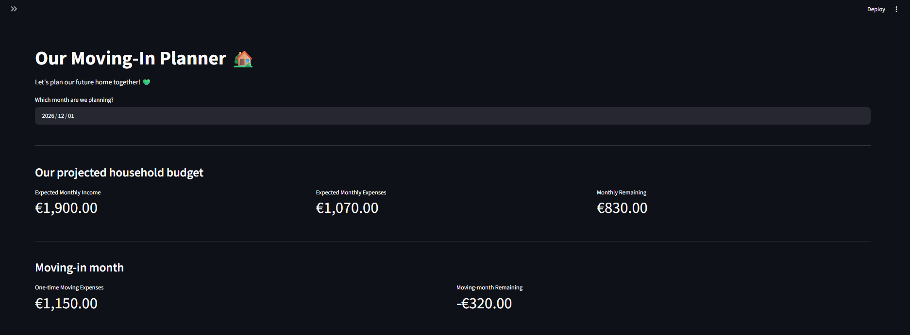
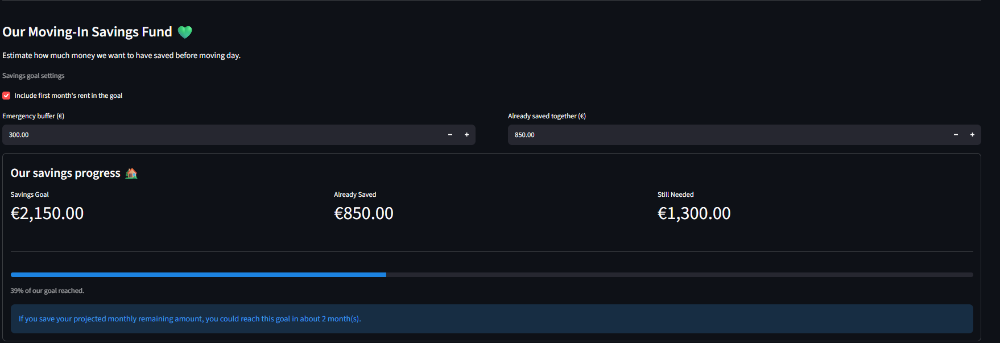
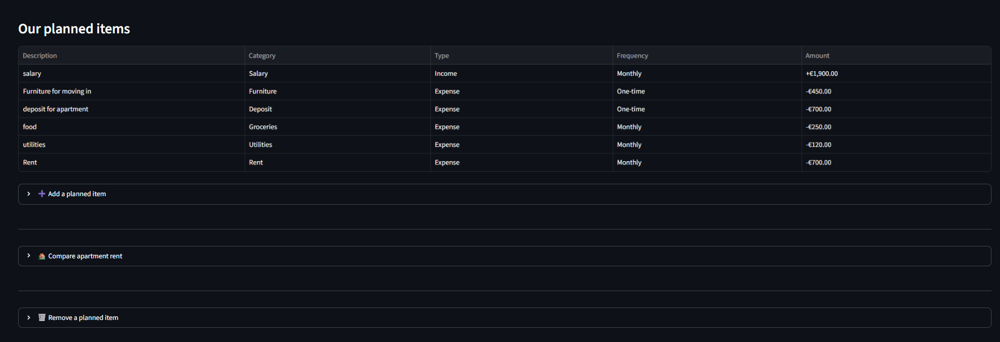

# OurBudget 💚

A household budgeting and moving-in planning application built with Python, Streamlit, and SQLite.

OurBudget is a personal software development project designed to help users organize their finances, track income and expenses, and estimate the costs associated with moving into a new home.

The application combines everyday financial tracking with a dedicated moving-in planner, allowing users to understand their monthly budget, explore different housing scenarios, and estimate their moving-in savings goals.

## Features

### Household Budget Dashboard

- Record income and expense transactions.
- Categorize transactions for easier organization.
- View monthly income, expenses, and net balance.
- Browse recorded transactions in an interactive table.
- Store transaction records in a local SQLite database.
- Delete transactions using confirmation dialogs to prevent accidental data loss.
- Manage transactions through expandable interface sections.

### Moving-In Planner

- Create monthly household financial plans.
- Record expected income and expenses.
- Distinguish between recurring monthly costs and one-time moving expenses.
- Calculate projected monthly income, expenses, and remaining balance.
- Estimate the financial impact of moving-in costs.
- Compare alternative apartment rental prices.
- Display personalized deletion warnings for important financial commitments.

### Moving-In Savings Fund

- Calculate a savings target based on planned one-time moving expenses.
- Optionally include the first month's rent in the savings goal.
- Configure an additional emergency savings buffer.
- Enter existing savings to estimate the remaining amount needed.
- Visualize savings progress using an interactive progress bar.
- Estimate the time needed to reach the savings goal based on projected monthly remaining income.

The savings fund currently functions as an interactive estimator. Savings balances and settings are not yet permanently stored in the database.

## Screenshots

### Household Budget Dashboard

Track household income and expenses, review monthly financial summaries, and manage recorded transactions.



### Transaction Management

Add income and expense transactions with categories, descriptions, amounts, and dates.



### Moving-In Planner

Estimate recurring household expenses, one-time moving costs, and projected monthly finances.



### Moving-In Savings Fund

Calculate a moving-in savings target, enter existing savings, and visualize progress toward the goal.



### Planned Household Expenses

Organize recurring and one-time household expenses using a dedicated planning interface.



## Technology Stack

| Technology | Purpose |
|------------|---------|
| Python | Application logic and financial calculations |
| Streamlit | Interactive web application interface |
| SQLite | Persistent local data storage |
| Git | Version control |
| GitHub | Source code hosting and project documentation |

## Project Structure

```text
OurBudget/
├── app.py
├── database.py
├── pages/
├── assets/
│   └── screenshots/
│       ├── dashboard.png
│       ├── transactions.png
│       ├── moving-in-planner.png
│       ├── moving-in-savings-fund.png
│       └── planned-items.png
├── requirements.txt
├── .gitignore
└── README.md
```

- `app.py` contains the main household budgeting dashboard.
- `database.py` manages database initialization and financial record operations.
- `pages/` contains the moving-in planner.
- `assets/screenshots/` contains application screenshots used in the project documentation.
- `requirements.txt` lists the application's Python dependencies.

## Installation

### 1. Clone the repository

```bash
git clone https://github.com/pb-3k/OurBudget.git
cd OurBudget
```

### 2. Create a virtual environment

```bash
python -m venv .venv
```

### 3. Activate the virtual environment

On Windows (PowerShell):

```powershell
.\.venv\Scripts\Activate.ps1
```

On macOS or Linux:

```bash
source .venv/bin/activate
```

### 4. Install dependencies

```bash
python -m pip install -r requirements.txt
```

### 5. Launch the application

```bash
python -m streamlit run app.py
```

The application should open in your browser at:

http://localhost:8501

The local database is initialized automatically when the application starts.

## Data Privacy

OurBudget currently uses a local SQLite database.

Personal financial records are excluded from version control through `.gitignore`, ensuring that local transaction data is not included in the public repository.

The project does not currently provide user authentication or cloud-based financial data synchronization.

For demonstration purposes, the repository screenshots use fictional financial information.

## Future Development

Planned improvements include:

- Persistent storage for savings balances and goal settings.
- Additional financial visualizations.
- Improved budget categorization and filtering.
- Automated tests for financial calculations and database operations.
- A publicly accessible demonstration using fictional financial data.
- Further improvements to the application interface.

## Project Background

OurBudget was developed as a personal learning project focused on strengthening practical software development skills.

The project explores Python application development, database integration, financial data processing, interactive user interfaces, input validation, and Git-based version control.

It also serves as an ongoing portfolio project demonstrating the development of a functional application from an initial concept.

## Author

**Bruno Davis Orinskis**

GitHub: [@pb-3k](https://github.com/pb-3k)